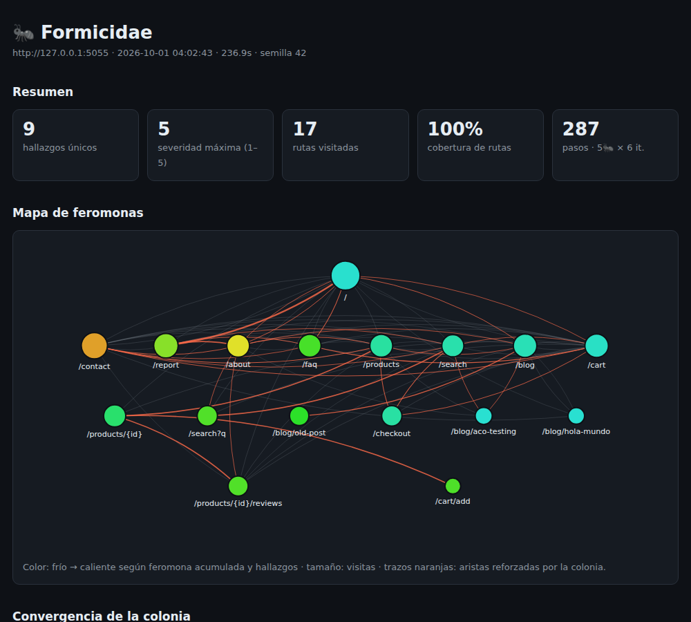

# 🐜 Formicidae

**Bio-inspired exploratory testing:** a colony of Playwright agents ("ants") autonomously crawls your web app. Every route that ends in an error gets pheromone, so the colony converges toward the most fragile parts of the app. When it's done, it generates an **HTML report with a heat map** and **reproducible Pytest tests** (the minimal path to each bug).




Full sample report: [`docs/report.html`](docs/report.html) · generated tests: [`docs/generated_tests/`](docs/generated_tests/)

## Quickstart

```bash
# Linux/macOS: use python3 if `python` doesn't exist; on Ubuntu/Debian:
#   sudo apt install python3-venv python3-pip
python3 -m venv .venv && source .venv/bin/activate    # Windows: .venv\Scripts\activate
pip install -e ".[dev]"
playwright install chromium

# Terminal 1: demo app with 8 planted bugs (leave it running)
python -m demo_app.app --port 5000

# Terminal 2 (activate the venv here too): launch the colony
formicidae run http://127.0.0.1:5000 --seed 42        # → formicidae-out/{report.html,result.json,generated_tests/}

# the generated tests FAIL while the bug exists (and pass once it's fixed)
FORMICIDAE_BASE_URL=http://127.0.0.1:5000 pytest formicidae-out/generated_tests
# Windows CMD: set FORMICIDAE_BASE_URL=http://127.0.0.1:5000  then run pytest
```

> On macOS, port 5000 is taken by AirPlay: use `--port 8000` and adjust the URLs accordingly.

Useful options: `--ants/--iterations/--steps`, `--exclude '/logout'` (URLs the ants must NOT follow), `--ignore REGEX`,
`--pheromones ph.json` (persists pheromone across runs: the next run starts already knowing which routes were fragile),
`--fail-on 4` (exit 1 if any finding has severity ≥ 4, useful as a CI gate), `--metrics-port 8011` (Prometheus).

## How it works

```
 nest (base URL)
      │  each ant: observes the page → picks an action → executes it → detects errors
      ▼
 ┌──────────┐   actions: links · buttons · forms (with fuzzing payloads)
 │  Ant     │   state  : route template  (/products/7 → /products/{id})
 └────┬─────┘
      │ findings (HTTP 4xx/5xx, JS exception, console.error, broken image, failed request, slowness)
      ▼
 ┌──────────────┐  deposits pheromone on the edges of the path   (higher severity = more pheromone)
 │ PheromoneMap │  evaporates at the end of each iteration
 └────┬─────────┘
      ▼
 minimizer → Pytest test generator → HTML report → Prometheus metrics
```

**Action selection** (ACO): `P(a | s) ∝ τ(s,a)^α · η(s,a)^β`, with `η = 1 / (1 + visits)` (novelty).
**τ generalizes by template** (`/products/{id}/reviews` shares pheromone across products) while **η measures the exact instance**, so the colony insists on a *class* of fragile route without stopping trying new instances.
**Deposit:** `Δτ = q · severity · γ^k` backwards along the path (k = distance to the error). A **previously known** finding deposits only `repeat_factor` (10%): without this, the colony obsesses over bugs it already found and stops exploring (happened to me, see below).
**Evaporation:** `τ ← max(τ_min, (1 − ρ) · τ)` per iteration.
**Fuzzing:** each field rotates through a list of payloads (SQLi, XSS, empty, 300 chars, negatives…) without repeating until exhausted.
**Minimization:** each path is reduced by removing blocks of steps as long as the bug still reproduces.

## Results (on the included demo app)

| | |
|---|---|
| Planted bugs detected | **9/9** unique findings: 8 testable + 1 performance issue (reported, not tested — it's flaky) |
| Verified run (`--seed 42`, default config) | 287 steps · ~6 min · **100% route coverage** by the end of iteration 3 |
| Generated tests | 8: **all fail** against the buggy app and **all pass** with `DEMO_FIXED=1` (verified in `tests/test_e2e.py`) |
| Path minimization | `/products/7/reviews`: 10 → **3** steps · `POST /cart/add`: 4 → 3 · `/search`: 3 → 2 |
| Colony vs. random walk (same budget, 3 seeds) | **9, 9, 9** vs **8, 6, 6** unique findings |

Real output from the verified run (Ubuntu, Python 3.14, headless Chromium):

```
iter 1/6: 7 unique findings, coverage 88%,  pheromone 87.84
iter 2/6: 8 unique findings, coverage 94%,  pheromone 119.50
iter 3/6: 9 unique findings, coverage 100%, pheromone 133.52
...
🐜 9 unique findings · 287 steps · 364.8s
  [sev 5] http_500 GET /search · POST /cart/add · GET /products/7/reviews
  [sev 4] js_exception ReferenceError: sendMessage is not defined
  [sev 2] console_error · http_404 ×2   [sev 1] slow_response · broken_image
→ 8 tests generated: 8 failed with bugs → 8 passed with DEMO_FIXED=1
```

> ⚠️ **Honesty about these numbers:** the demo app is mine and I planted the bugs myself; 3 seeds is a small sample; the random baseline keeps the payload rotation, so it's stronger than a purely random fuzzer. These numbers validate the algorithm — they don't claim it finds X bugs in real-world systems. Reproduce: `python scripts/benchmark.py --seeds 3`.

## Tests

```bash
pytest -m "not e2e"   # 15 unit tests (pheromone, detectors, generator, minimizer) – seconds
pytest                # + e2e: full colony run → generated tests fail/pass (~6 min on 1 CPU)
```

## Metrics (Prometheus / Grafana)

`formicidae run … --metrics-port 8011` exposes `formicidae_findings_unique`, `formicidae_route_coverage_ratio`,
`formicidae_pheromone_total`, `formicidae_findings_by_severity{severity=…}`, etc. — `/metrics` endpoint verified locally.
`docker compose up -d` brings up Prometheus + Grafana (compose not yet tested end-to-end; no Grafana dashboard yet).

## Known limitations

- Ants run **sequentially** (one browser at a time); no parallelism yet.
- It detects what's **observable**: HTTP/JS/console/DOM errors. It doesn't validate business logic or whether things "look right".
- Session state: if a bug depends on previously created data (cart, login), the replay may not reproduce it. No automatic login yet (use `--exclude` to avoid logout/destructive actions).
- Selectors are `a[href=…]`, `form[action=…]`, `button:has-text(…)`: fine for traditional apps; SPAs with lots of clickable `div`s are covered less well.
- **Only run it against apps you own or have permission to test**: it sends injection payloads and submits real forms.

## What I learned building it

- The first version **got stuck**: it kept reinforcing already-known bugs and never found the 500s (the most severe ones). Fixed with novelty-based deposit, global novelty for links shared by the nav menu, and payload rotation.
- A "convergence" metric (% of steps with a finding) **did not go up** (31% → 29%), so I don't show it as evidence; the metrics that do say something useful are cumulative findings, coverage, and total pheromone.
- The first minimizer (remove one step at a time, then blocks of `n/2`) left 7-step paths that actually needed 3: a unit test covers that now.

## Structure

```
formicidae/   actions · ant · colony · pheromone · detectors · minimize · generator · report · metrics · cli
demo_app/     Flask shop with 8 planted bugs (DEMO_FIXED=1 fixes them all)
tests/        unit + e2e             scripts/benchmark.py        monitoring/ + docker-compose.yml
.github/workflows/ci.yml  (tests + demo report published to GitHub Pages)
```

MIT © Selinne Carlin
